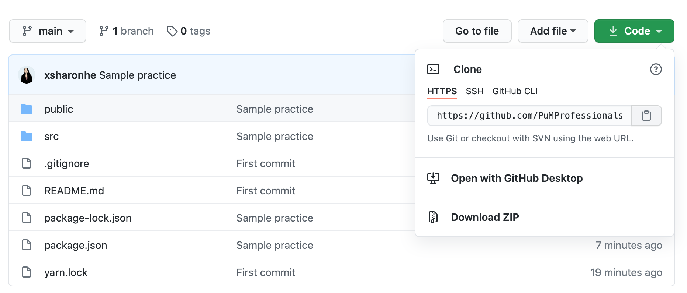
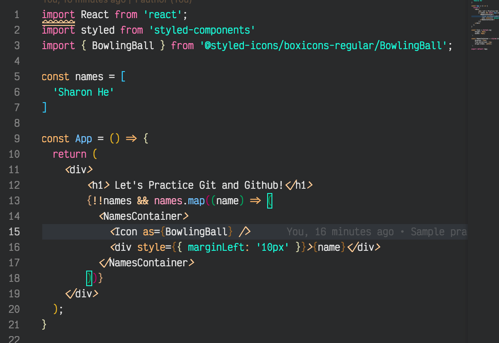
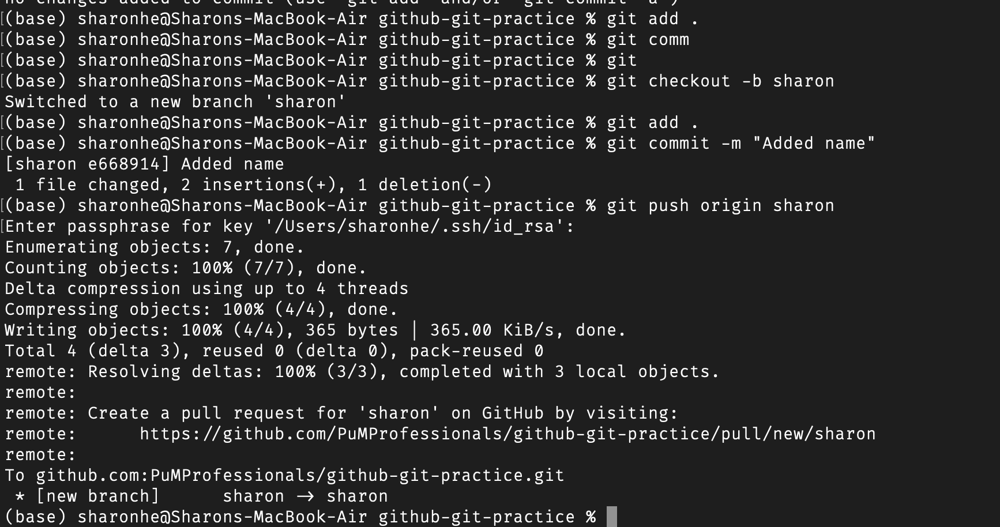
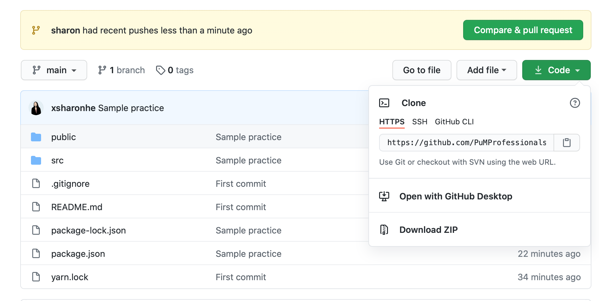
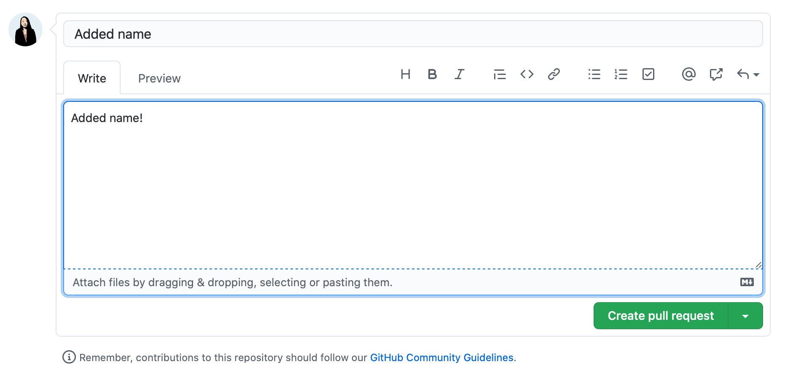
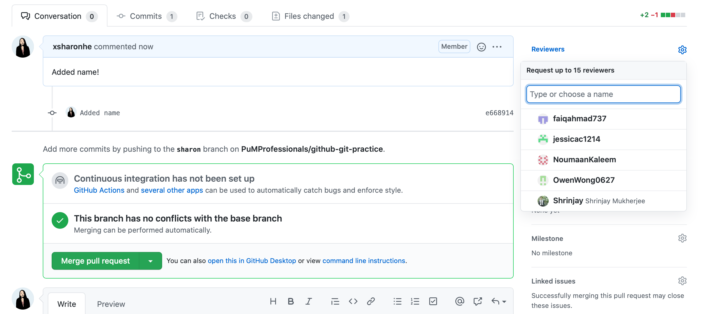

# Github and Git Guide
This will give you a brief guide about how to use Github and Git, and how to go about a workflow of working as a software developer. This is briefly what basic React looks like!

To begin you will need to install these tools (you may or may not already have them):
* `git`: https://git-scm.com/book/en/v2/Getting-Started-Installing-Git -> this is a version control system! you can read more about it but what this allows us to do is have many people simultaneously work on a project
---> Windows is so very different, here's a decent Youtube tutorial: https://www.youtube.com/watch?v=2j7fD92g-gE
* `node & npm`: https://nodejs.org/en/download/ -> install node (a JavaScript runtime you don't need to know what this is), but it comes with npm which is what you need it stands for node package manager and allows us to manage JavaScript packages. think of these as "plugins" from Wordpress.
* `VSCode`: https://code.visualstudio.com/download -> one of the most beginner friendly coding environments

Unfortunately, I can't give more specific installation instructions. Those instructions are some of the best! Be sure to remember if you're using Mac or Windows. It differs. If you get errors, `google` it's most likely that a lot of people have the same issue!

After we will begin the process of using GitHub and Git. I learned from: https://guides.github.com/activities/hello-world/ (HIGHLY RECOMMEND), but we will also practice with this repo to get used to npm and React! 

This is using your terminal which may be a bit foreign, but it's practically always necessary in the real world. Potentially you could find Desktop versions to make this process easier.

1. Clone a repo:

Click the green code button and make sure it is HTTPS (SSH is a bit more complicated to setup) and click the copy and paste button / icon on the right beside the link.

In your command line (terminal), type: `git clone https://github.com/PuMProfessionals/github-git-practice.git` where https://github.com/PuMProfessionals/github-git-practice.git is the link you just copied.

2. It should be cloned! As in you have a version on your local computer. Github acts as a "master copy" for everyone. Then, open up the folder that you just cloned and copy the folder address. Go to the command line and type `cd 'paste your file location here'` to go into the project in Git Bash. Open up VSCode, and open up the project.
3. In your terminal also type: `npm install` -> this will install all the node packages you need! This is what allows us to run web applications by using third-party packages... for free!
4. Add a new branch. This is what you do to contribute your changes, so it doesn't affect everyone else's until after you code! This is your personal branch that will be affected by no one else but you. Your changes also won't be added until after you are sure it works. Type in your command line `git checkout -b branchname` where branchname is your name. (some of the processes are shown in the Git Commands photo in step 8) This basically checks you out of the main branch and creates a new branch called branchname. Preferably, name it something else because we can't have repeated branch names. Perhaps your name maybe.
5. Click into `src->App.js` and open this file.

6. Add your name to the array names so:
`const names = [
  'Sharon He', 
  'Name X' <--- Added name
]
`
6. To see if your changes have been made, save the file. In your command terminal, then type `npm start`. This will start up a local development environment, and you will see: 

7. If it is successful, go back to your command line and type: 
* `git status` -> this will help check if you actually changed your files. you will see what you added or deleted
* `git add App.js` -> this will add all your files to the branch that will then be commited
* `git commit -m "I have commited"` -> this is a brief message of what you did with what is in quotation marks as what you added
* `git push origin branchname` this will push your changes to the branch you created

8. Now we will make a pull request so your changes can be merged into the main branch (the master copy!)
9. After putting your Git commands, you can now go back to github, this repository and you should see:

Press `Compare & pull request`
10. Make the pull request by pressing `Create Pull Request`

11. First make sure to put me as a Reviewer (or anyone else if you want). Normally the process is to get your code reviewed first, so we will try this for now!
12. In the slack channel @ me and I will get to review your code. In this case, I will approve it, but in a coding setting, I might request changes before merging. This is so we keep the code quality to a certain standard, and make sure no breaking changes are made.

Once I approve it you can then press `Merge pull request`

** There are other concepts that are not covered like merge conflicts which you probably will encounter. This just means there's code from the master copy that will be overwritten by your branch. This is Git warning us!
You can message me when this happens, or try fixing it on your own:
- In your terminal in the file of this repository: type `git pull origin main` -> you are pulling the differences into your branch
- Go to the files that have conflicts on VSCode they will be marked as C. This is most likely only the `App.js` file since it is the only one we are fixing.
- Remove all the foreign markers <<< >>> etc.
- Redo the process of the git commands (step 8) and add those changes, and go back to your pull request. You should now be able to merge.
